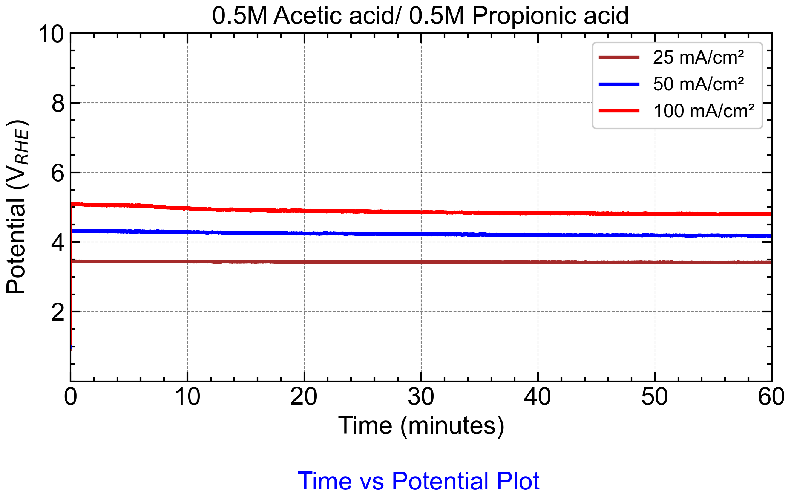

# Chronopotentiometry-
# 🔋 Chronopotentiometry RHE Plotter — EC-Lab Data (Three-Electrode System)

This repository provides a Python script for processing and plotting **constant current (Chronopotentiometry)** data collected using a **three-electrode setup** in **EC-Lab (BioLogic)**. The script converts the measured electrode potential from Ag/AgCl reference to the **RHE scale**, aligns time to zero, and outputs a clean, comparative plot.

---

## ✅ Features

- Converts **Ewe (vs Ag/AgCl)** to **ERHE** using pH correction
- Aligns time series to start at 0 minutes
- Accepts multiple datasets for comparison (e.g., different current densities)
- Custom legends and line colors
- Publication-ready plot with SciencePlot styling

---

## 📊 Example Output

Below is an example plot showing time vs. RHE-corrected potential:



---

## 📁 Input File Format

Each `.txt` file must be exported from EC-Lab and contain tab-separated columns with headers. Required columns include:
<Time/s> <Ewe/V>

markdown
Copy
Edit

Typical export settings:
- Format: `.txt`
- Delimiter: **Tab-separated**
- Include headers

---

## ⚙️ How to Use

1. Export your **Chronopotentiometry** data from EC-Lab.
2. Place the `.txt` files in your project folder.
3. Edit the Python script to match:
   - `file_paths`: list of file names
   - `custom_legends`: matching labels
   - `line_colors`: custom colors for lines
4. Run the script:

```bash
python CC.ipynb
Output image is saved as CC1.png

🧪 RHE Conversion Formula
For pH = 5, the conversion from Ewe (vs Ag/AgCl) to RHE is:

mathematica
Copy
Edit
E(RHE) = Ewe + 0.21 + 0.059 × pH
You can change the pH value in the script if needed.

📦 Requirements
Install the required Python packages:

bash
Copy
Edit
pip install pandas matplotlib SciencePlots
Ensure your matplotlib is configured to use science style:

python
Copy
Edit
plt.style.use(['science', 'notebook', 'grid'])
🐍 Included Script
This repo includes the following file:

Copy
Edit
CC.ipynb
This script performs:

Time alignment

pH-based RHE conversion

Clean line plotting with labels and grid

📬 License & Contributions
Open to all scientific users! Feel free to fork, modify, and contribute improvements.

